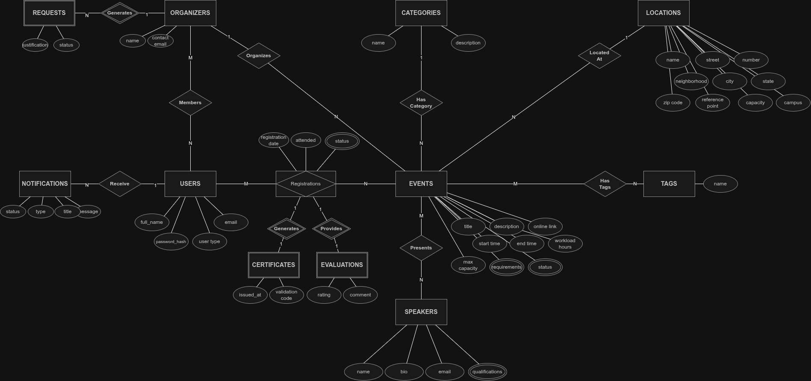
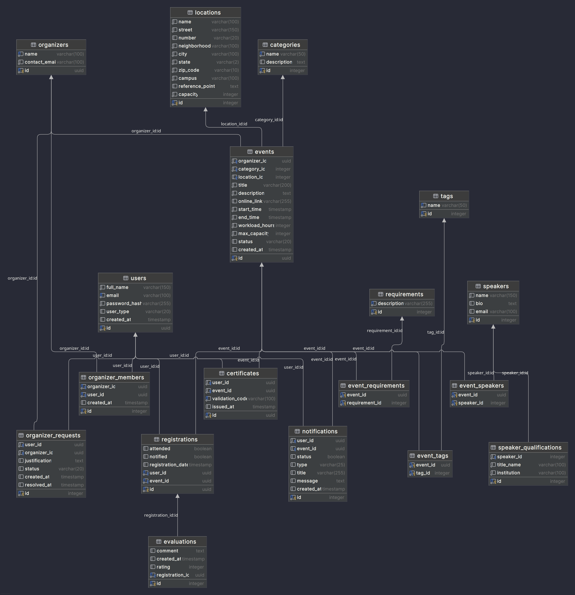

# Plataforma de Gestão de Eventos Acadêmicos e Culturais (GEAC)

# Integrantes do grupo
Dimas Celestino da Silva Neto
José Portela da Silva Neto
Julio Antonio de Cerqueira Neto
Pedro Tobias Souza Guerra

# Porta que a aplicação está rodando
Banco de dados: 5432,
BackEnd: 8080,
FrontEnd: 3000;
---

Requisitos referentes a segunda entrega do projeto da disciplina de Banco de Dados.

---

Primeiramente, o dicionário dos dados está presente no arquivo .pdf dentro do repositório.

---

## 🚀 Como Rodar o Projeto

Siga os passos abaixo para subir o banco de dados e popular o esquema automaticamente:

1.  **Clone o repositório** (se ainda não o fez):
    ```bash
    git clone git@github.com:GestaoDeEventosAcademicosECulturaisV2/docs.git
    ```

2.  **Verifique o arquivo de inicialização**:
    Certifique-se de que o script SQL com a estrutura do banco está presente na pasta mapeada no volume do Docker.

3.  **Suba o container**:
    Execute o comando abaixo na raiz do projeto para iniciar o serviço do PostgreSQL em segundo plano:
    ```bash
    docker-compose up -d
    ```

4.  **Verifique o status**:
    Para confirmar se o banco subiu corretamente:
    ```bash
    docker-compose ps
    ```
    *O status deve estar como `Up`.*

5.  **Acesse o Banco de Dados**:
    O banco estará acessível na porta **5432**. Você pode usar qualquer cliente SQL (DBeaver, PGAdmin, DataGrip) ou via terminal.

---

### 💾 Método de Povoamento (Seed)

O banco de dados é **povoado automaticamente** na primeira execução do container. 

Utilizamos o recurso nativo da imagem oficial do PostgreSQL no Docker: qualquer arquivo `.sql` presente no diretório `/docker-entrypoint-initdb.d/` dentro do container é executado automaticamente na criação do volume.

O script SQL incluído neste repositório contém:
1.  **DDL (Data Definition Language):** Os comandos `CREATE TABLE` para estruturar o esquema.
2.  **DML (Data Manipulation Language):** Os comandos `INSERT` que inserem os dados iniciais de teste (usuários, eventos, locais e inscrições).

Dessa forma, não é necessário rodar scripts manualmente; ao subir o container (`docker-compose up`), o ambiente já estará pronto e com dados.

---
### Para acessar as views e o crud do projeto entre como administrador
email: admin@geac.com
senha: admin123

### 🛑 Como Parar o Projeto

Para parar a execução e remover os containers:

```bash
docker-compose down
```

---

## Diagrama Atualizado



## Banco de dados


